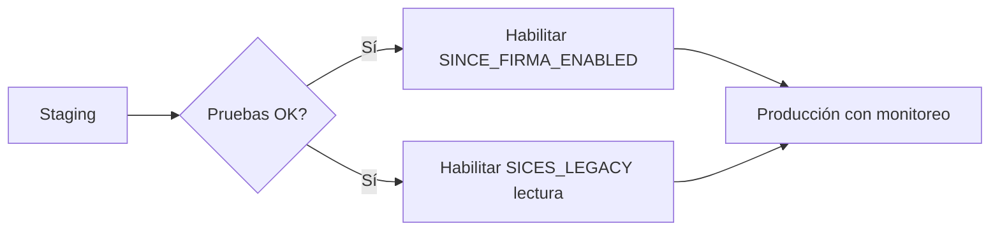

# 06 — Seguridad, variables de entorno e integraciones

## Autenticación y sesión

| Capa | Implementación |
|------|----------------|
| API | Laravel Sanctum — Personal Access Token |
| Login | `POST /api/v1/auth/login` |
| Header | `Authorization: Bearer {token}` |
| Frontend | Token en `localStorage` (`sices_token`) |
| 401 | Interceptor Axios → logout + redirect login |

### Riesgo en producción

`localStorage` es vulnerable a **XSS**. Para datos reales sensibles valorar:

- Cookies httpOnly + SameSite
- CSP estricto en la SPA
- Rotación de tokens / refresh

## Autorización

| Mecanismo | Uso |
|-----------|-----|
| Spatie Permission | Roles y permisos en BD |
| `permission_or` middleware | Rutas API (OR de permisos) |
| Policies | Modelos críticos (documento, alumno…) |
| Guards React | `RequirePermission`, `Guard` en router |
| Alcance institucional | `usuario_instituciones`, `usuario_sedes` |

**Regla UI:** comprobar `permissions[]`, no asumir por nombre de rol.

## Variables de entorno críticas

Copiar desde `.env.example`. **Nunca** commitear `.env` con secretos reales.

### Aplicación

| Variable | Propósito |
|----------|-----------|
| `APP_KEY` | Cifrado Laravel — obligatorio |
| `APP_ENV` | `production` en prod |
| `APP_DEBUG` | **false** en prod |
| `DB_*` | MySQL principal |

### Integraciones (flags de seguridad)

| Grupo | Flag principal | Default seguro |
|-------|----------------|----------------|
| Informix | `INFORMIX_ENABLED` | `false` |
| Informix escritura | `INFORMIX_WRITE_ENABLED` | `false` |
| SICES legacy | `SICES_LEGACY_ENABLED` | `false` |
| Shadow legacy | `SICES_LEGACY_SHADOW_ENABLED` | `false` |
| Writeback legacy | `SICES_LEGACY_WRITEBACK_ENABLED` | `false` |
| Control escolar externo | `CONTROL_ESCOLAR_ENABLED` | `false` |
| Solo lectura CE | `CONTROL_ESCOLAR_READ_ONLY` | `true` |
| Firma SINCE | `SINCE_FIRMA_ENABLED` | `false` |
| Simulación firma | `SINCE_FIRMA_SIMULATED` | `false` |

### Firma SEP (SINCE servicio 34)

| Variable | Notas |
|----------|-------|
| `SINCE_FIRMA_PROD_URL` | Endpoint producción (red interna) |
| `SINCE_FIRMA_DEV_URL` | Endpoint desarrollo |
| `SINCE_FIRMA_TIMEOUT` | 120s típico |
| `SEP_FIRMA_*` | Config duplicada en `config/certificacion.php` — unificar en operación |

**Código:** `app/Infrastructure/Since/SinceFirmaClient.php`  
**Bridge legacy:** `LegacySinceSigningBridgeService.php`

### Informix / SICES legacy

| Variable | Notas |
|----------|-------|
| `INFORMIX_HOST`, `INFORMIX_DATABASE`, … | Conexión ODBC/driver |
| `SICES_LEGACY_*` | Tablas certificados/materias shadow |
| `SICES_LEGACY_CONSULTA_SEP_URL` | URL pública SEP |

**Código:** `app/Infrastructure/SicesLegacy/`

### Control escolar MySQL

| Variable | Notas |
|----------|-------|
| `CONTROL_ESCOLAR_HOST`, `DATABASE`, … | BD externa lectura |
| `CONTROL_ESCOLAR_READ_ONLY` | Mantener true si solo sync |

**Código:** `DatabaseControlEscolarSourceAdapter`, `ControlEscolarSyncService`

### PDF / Jasper

`JASPER_*`, `PDF_*` — rutas servidor; no exponer credenciales al cliente.

## Integraciones — cuándo activar

Siempre con:

- `integraciones_logs` revisados
- Usuario técnico `sistemas` con permisos mínimos necesarios
- Rollback: flags a `false`

## Consulta pública

- Ruta sin auth: token en URL
- Tokens en tabla `url_short_tokens`
- Validar expiración y rate limit en producción

## Seeders y datos demo

`DatabaseSeeder` solo ejecuta catálogos institucionales (`InstitutionalBaseSeeder`); no hay seeders demo en el repositorio.

Contraseñas demo no deben existir en prod.

## Siguiente lectura

- [09 - Diagnóstico y go-live](./09-diagnostico-go-live.md)
- [datos-reales/importacion-controlada.md](./datos-reales/importacion-controlada.md)
