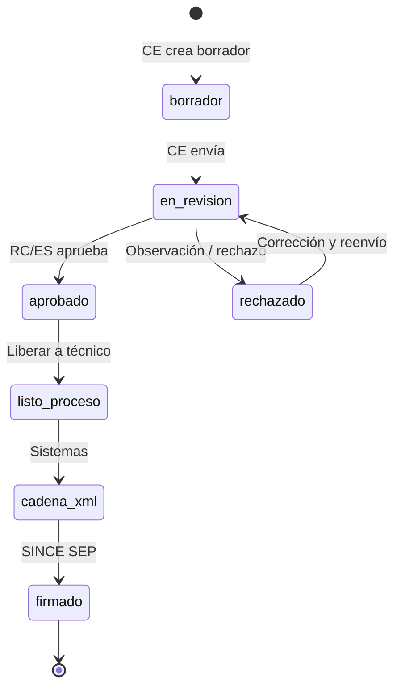
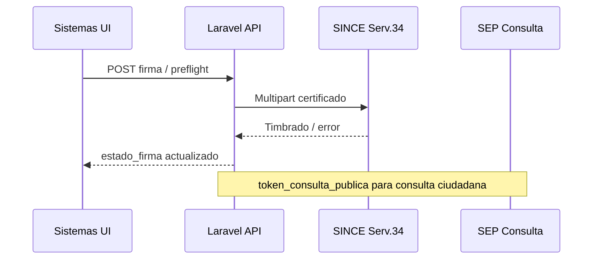

# 08 — Flujos de certificación

## Vista general del ciclo de vida



Estados reales repartidos en columnas: `estado_workflow`, `estado_cadena`, `estado_xml`, `estado_firma`, `estado_pdf`.

## Por rol — qué hace cada uno

### 1. Control escolar

| Paso | UI | API / acción |
|------|-----|--------------|
| Solicitar certificado | `/app/certificacion/solicitud` | Crear documento borrador |
| Borradores | `/app/documentos/bandejas/borradores` | Editar |
| Enviar revisión | Bandeja / wizard | Cambio a `en_revision` |

**Menú:** grupo “Certificación escolar” bajo CE.

### 2. Educación Superior

| Paso | UI | API |
|------|-----|-----|
| Supervisión KPIs | `/app/educacion-superior/certificacion` | Varias bandejas + métricas |
| Validaciones normativas | `.../validaciones-normativas` | Documentos + solicitudes matrícula |
| Certificación UPN | `.../upn/certificacion` | Bandejas con `subsistema=UPN` |
| Revisión expediente | `.../revision` | `BandejaRevisionInstitucionalPage` |
| Liberar a técnico | Acción en tabla supervisión | `marcarListoParaFirma` |

**No hace:** firmar SEP, generar cadena/XML (mensaje explícito en UI).

### 3. Responsable certificación

| Paso | UI | API |
|------|-----|-----|
| Dashboard RC | `/app/certificacion/dashboard` | Resumen |
| Revisión institucional | `/app/certificacion/revision` | Dictamen |
| Solicitudes / documentos | Módulo certificación RC | Bandejas |
| Firma electrónica | Seguimiento solo | Sin botón firmar SEP |

Layout: `CertificacionLayout` (sidebar CERTIFICACIÓN).

### 4. Sistemas

| Paso | UI | API |
|------|-----|-----|
| Proceso técnico | `/app/sistemas/proceso-tecnico-certificacion` | Cadena, XML, preflight, firma |
| Detalle documento | `.../:id` | Operaciones técnicas |
| Legacy / logs | Configuración, logs | Informix, integraciones |

**Permisos:** `generar_cadena`, `xml.generar`, `firma.ejecutar`, etc.

## Flujo UPN específico

1. Filtro backend: `subsistema=UPN` + `subsistema_id` si existe en catálogo.
2. Bandejas por defecto: 5 (en-revision, pendientes, aprobados, rechazados, listos-para-firma).
3. UI: `UpnCertificacionPage` + `useUpnCertificacionBandeja` (timeout 22s).
4. Acciones: aprobar, rechazar, observar, liberar — según `upnCertificacionPermissions.js`.

Test: `tests/Feature/EducacionSuperior/UpnCertificacionBandejaTest.php`

## Bandejas API — referencia rápida

```
GET /api/v1/certificacion/bandejas/documentos-academicos/en-revision
GET /api/v1/certificacion/bandejas/documentos-academicos/pendientes-revision
GET /api/v1/certificacion/bandejas/documentos-academicos/aprobados
GET /api/v1/certificacion/bandejas/documentos-academicos/rechazados
GET /api/v1/certificacion/bandejas/documentos-academicos/listos-para-firma
GET /api/v1/certificacion/bandejas/documentos-academicos/firmados
GET /api/v1/certificacion/bandejas/documentos-academicos/resumen
```

Parámetros UPN ejemplo:

```
?subsistema=UPN&per_page=40&institucion_id=3
```

## DEC-Normal 2025

Pipeline XML/cadena para certificados normales — ver:

- [plan-implementacion-dec-normal-2025.md](./plan-implementacion-dec-normal-2025.md)
- Servicios `DecNormal2025*`, `XmlDecNormal2025Builder`

## Legacy Informix / shadow

Cuando `SICES_LEGACY_ENABLED=true`:

- Consulta certificados históricos
- Export shadow hacia servicio 34
- **No** habilitar writeback sin ventana de mantenimiento

## Diagrama de integración firma



## Siguiente lectura

- [05 - Matriz de roles y menús](./05-roles-menus-matriz.md)
- [06 - Seguridad e integraciones](./06-seguridad-integraciones.md)
- [plan-implementacion-dec-normal-2025.md](./plan-implementacion-dec-normal-2025.md)
